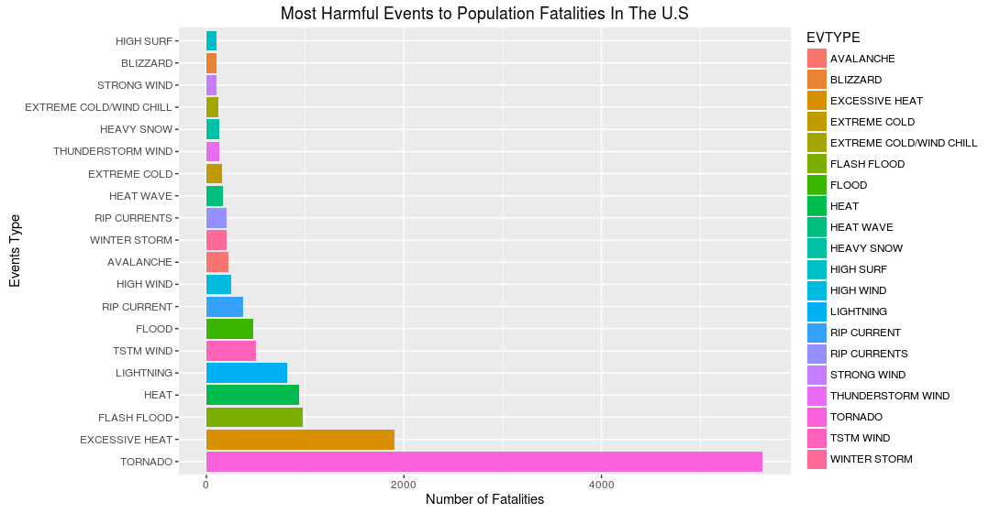
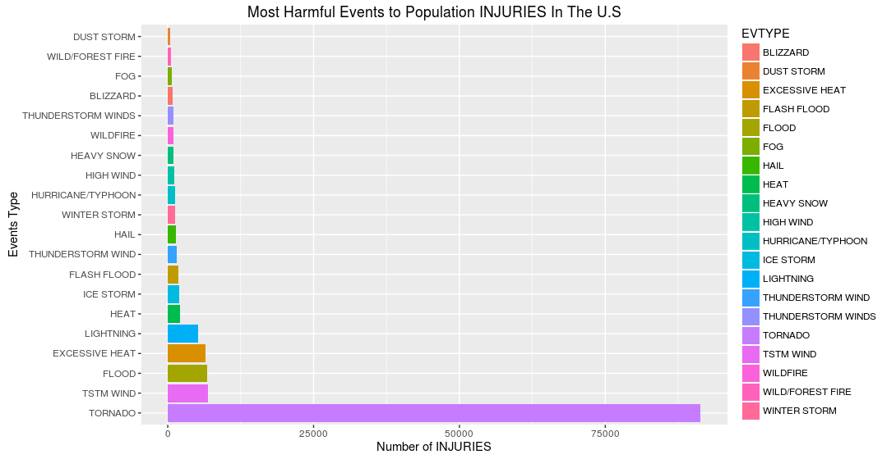
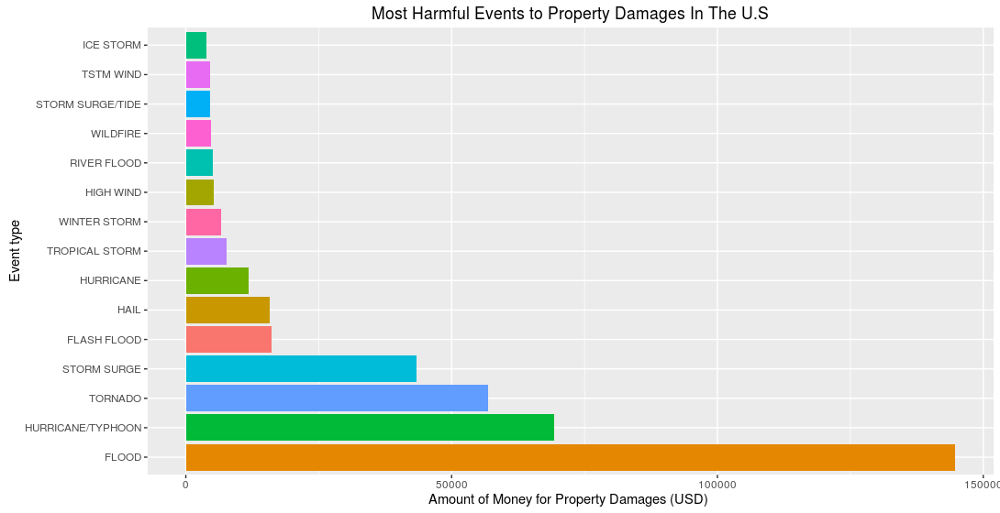
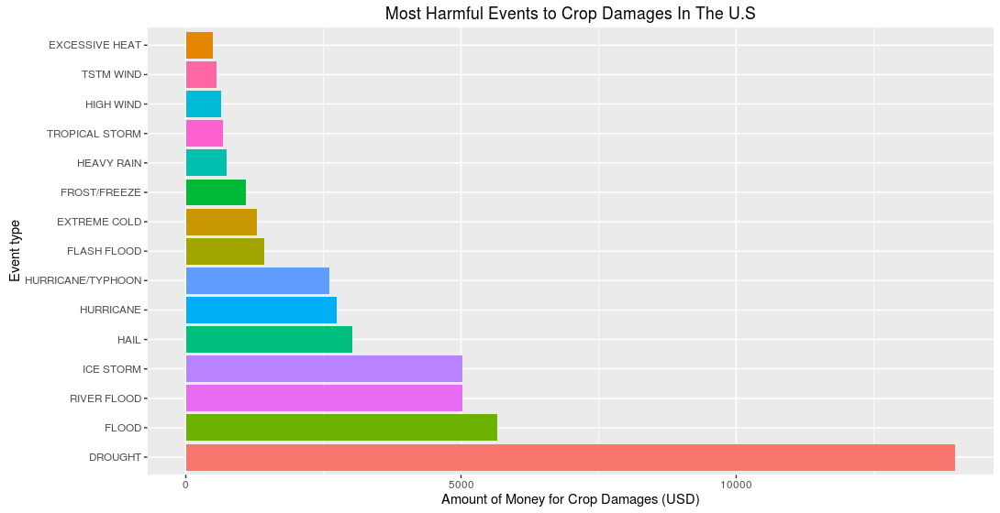

```{r setup, include=FALSE, results='asis'}
library(ggplot2)
knitr::opts_chunk$set(echo = TRUE)
```

### A. Synopsis

The goal of the Project is to Analyze the National Oceanic & Atmospheric Administration Database and determine the effects of extreme weather conditions on economic and social life.

The database include the period between 1950 and November 2011. In the earlier years of the database there are generally fewer events recorded, most likely due to a lack of good records. More recent years should be considered more complete.

The Project  aims to investigate  different types of extreme weather conditions and identify the ones which are most harmful on the populations safety taking into considertion general injuries and fatalities. In addition to resulting damages and casaulties, the economic consequences will be analyzed by exploring the financial implications that affect the community.


### B. Data Processing
####   Downloading, Unzipping and loading Database

Setting working directory to guarantee that all files are in the same repository.
```r
setwd("/home/jagoul/Coursera/Data-Science-Specialization/Reproducible Research/Week 3&4/Reproducible-Research-Project-Two/")
```

Executing the code for the first time, checking if file doesn't exist,
Database then will be fetched, downloaded and saved via the url provided below and saved under the file name `NOAA_Database.csv.bz2`

```r

if(!file.exists("NOAA_Database.csv.bz2")){
download.file(url ="https://d396qusza40orc.cloudfront.net/repdata%2Fdata%2FStormData.csv.bz2",
destfile = "./NOAA_Database.csv.bz2", method = "libcurl", mode = 'w' )
}
```
`csv.bz2` format doesn't require any unzipping function to be read.loading dataset into R directly
File already exists.
loading database will take few minutes , Thanks for your patience!!

```r
NOAADatabase <- read.csv(file ="NOAA_Database.csv.bz2",header = TRUE)
```
After examination of the database using Storm Data Documentation file, we only need the following columns to analyze the most harmful events which affect directly population health, properties and crops harvest:`EVTYPE`, `FATALITIES`, `INJURIES`, `PROPDMG`, `PROPDMGEXP`, `CROPDMG`, `CROPDMGEXP`.
Subsetting NOAA Database to a smaller matrix with only columns mentioned above.

```r
NOAASubset <- subset(NOAADatabase,select =  c("EVTYPE", "FATALITIES", "INJURIES", "PROPDMG", "PROPDMGEXP", "CROPDMG", "CROPDMGEXP"))
```
### C. Results

####   1. **Most harmful events with respect to population health**
####     *Calculate the sum of fatalties and injuries caused by each event by aggregating most harmful weather                         conditions and sorting the results in descending order for both fatalities and Injuries outputs.*  

```r
fatal_Injur_aggregate <- aggregate(cbind(FATALITIES,INJURIES) ~ EVTYPE, NOAASubset, sum)
fatalities <- fatal_Injur_aggregate[order(fatal_Injur_aggregate$FATALITIES,decreasing = TRUE),c("EVTYPE","FATALITIES")]
injuries <- fatal_Injur_aggregate[order(fatal_Injur_aggregate$INJURIES, decreasing = TRUE),c("EVTYPE","INJURIES")]
fatalitySummary <- head(fatalities,20)
injurySummary <- head(injuries,20)
fatalitySummary
injurySummary
```

####      **Displaying Fatalities and Injuries results seggregated by Event Type**

```r
par(mar=c(5,4,2,1))
g <- ggplot(fatalitySummary,aes(x=reorder(EVTYPE,-FATALITIES), FATALITIES, fill=EVTYPE))
g+ geom_bar(stat ="identity",position = position_dodge())+coord_flip()+
ylab("Number of Fatalities")+xlab("Events Type")+
ggtitle("Most Harmful Events to Population Fatalities In The U.S")
```



```r
par(mar=c(5,4,2,1))
g <- ggplot(injurySummary,aes(x=reorder(EVTYPE,-INJURIES), INJURIES, fill=EVTYPE))
g+ geom_bar(stat ="identity",position = position_dodge())+coord_flip()+
ylab("Number of Injuries")+xlab("Events Type")+
ggtitle("Most Harmful Events to Population Injuries In The U.S")
```



####   2. **Events have the greatest economic consequences**
####   **'PROPDMG' and CROPDMG are two indicators measuring the economic consequences per weather event, to summarize those columns we need to convert their exponential values 'PROPDMGEXP' and 'CROPDMGEXP' into numeric values i.e.:k=10^3, h/H = 10^2, etc...  

```r
convCharToNum <- function(exponential){
  if(exponential %in% c("h","H"))
    return(10^2)
  if (exponential %in% c("k","K"))
    return(10^3)
  if (exponential %in% c("m","M"))
    return(10^6)
  if (exponential %in% c("b", "B"))
      return(10^9)
  if (exponential %in% c("-","+","?"))
    return(1)
  if (!is.na(exponential)& !is.numeric(exponential))
    return(is.numeric(exponential))
  else stop("Break the loop, invalid value")
}


propertyExponent <- sapply(NOAASubset$PROPDMGEXP, convCharToNum)
NOAASubset$PropertyDamage <- NOAASubset$PROPDMG * propertyExponent

cropExponent <- sapply(NOAASubset$CROPDMGEXP, convCharToNum)
NOAASubset$CropDamage <- NOAASubset$CROPDMG * cropExponent
```
### Aggregating the total amount (in USD) of Property and Crap Damages and eleminating any events with no fnancial damage from the dataset to make it clean and tidy.

```r
prop_Crop_aggregateAll <- aggregate(cbind(PropertyDamage,CropDamage) ~ EVTYPE, NOAASubset, sum)
prop_Crop_aggregate <- prop_Crop_aggregateAll[(prop_Crop_aggregateAll$PropertyDamage > 0 | prop_Crop_aggregateAll$PropertyDamage > 0 ),]

PropertyDamages <- prop_Crop_aggregate[order(prop_Crop_aggregate$PropertyDamage,decreasing = TRUE),c("EVTYPE","PropertyDamage")]
CropDamages <- prop_Crop_aggregate[order(prop_Crop_aggregate$CropDamage, decreasing = TRUE),c("EVTYPE","CropDamage")]
topPropertyDamages <- head(PropertyDamages, 15)
topCropDamages <- head(CropDamages, 15)
```
### Plotting Property and Crop Damages seggregating By Event Type

```r
par(mar=c(5,4,2,1))
g <- ggplot(topPropertyDamages,aes(x=reorder(EVTYPE,-PropertyDamage), PropertyDamage/10^6, fill=EVTYPE))
g+ geom_bar(stat ="identity", position = position_identity()) + coord_flip()+
ylab("Amount of Money for Property Damages (USD) ") + xlab("Event type") +
ggtitle("Most Harmful Events to Property Damages In The U.S")+
theme(legend.position="none")
```


```r
par(mar=c(5,4,2,1))
g <- ggplot(topCropDamages,aes(x=reorder(EVTYPE,-CropDamage), CropDamage/10^6, fill=EVTYPE))
g+ geom_bar(stat ="identity", position = position_identity()) + coord_flip()+
ylab("Amount of Money for Crop Damages (USD)") + xlab("Event type") +
ggtitle("Most Harmful Events to Crop Damages In The U.S")+
theme(legend.position="none")
```
